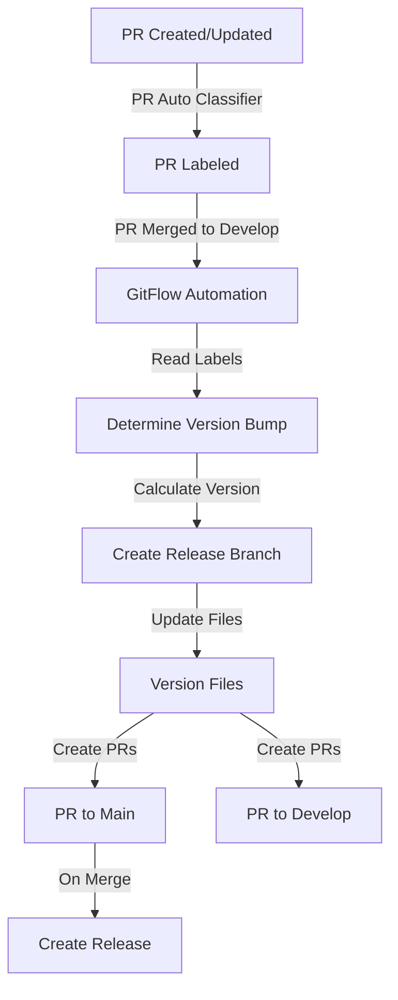

# GitFlow Automation Action 🔄

[](https://github.com/raultoto/gitflow_automation/releases)
[](https://github.com/marketplace/actions/gitflow-automation)
[](https://opensource.org/licenses/MIT)

Automate your GitFlow release process with this GitHub Action. It handles version management, branch creation, and pull request generation following GitFlow conventions.

## ⚠️ Prerequisites

This action requires [PR Auto Classifier](https://github.com/marketplace/actions/pr-auto-classifier) to be installed in your repository. The PR Auto Classifier automatically labels your PRs with version bump tags (`major`, `minor`, `patch`) which this action uses to determine version increments.

### Setting up PR Auto Classifier

Add this workflow to your repository at `.github/workflows/pr-classification.yml`:

```yaml
name: PR Classification
on:
  pull_request:
    types: [opened, synchronize]

permissions:
  pull-requests: write
  contents: read

jobs:
  classify-pr:
    runs-on: ubuntu-latest
    steps:
      - uses: actions/checkout@v2
        with:
          fetch-depth: 0
          
      - name: Classify PR
        uses: raultoto/pr_auto_classifier@v1.0.1
        with:
          github-token: ${{ secrets.GITHUB_TOKEN }}
```

This will:
- 🏷️ Automatically classify your PRs based on size
- 📝 Add labels for file types changed
- 📦 Determine version bump type (major/minor/patch)
- 💬 Add a comment with classification details

## 🌟 Features

- 🔄 **Automated GitFlow Process**: Streamlines the entire release workflow
- 📦 **Smart Version Bumping**: Automatically determines version increments based on PR labels from PR Auto Classifier
- 🏷️ **Semantic Versioning**: Follows SemVer conventions for version management
- 🔀 **Branch Management**: Creates and manages release branches automatically
- 📝 **Documentation**: Generates release notes and PR descriptions
- 🤝 **Pull Request Creation**: Automatically creates PRs for main and develop branches
- 📋 **Version File Updates**: Updates version numbers in multiple file types

## 📊 Complete Workflow



## 🚀 Usage

Add this workflow to your repository at `.github/workflows/release.yml`:

```yaml
name: GitFlow Release Process
on:
  push:
    branches:
      - develop

permissions:
  contents: write
  pull-requests: write

jobs:
  release:
    runs-on: ubuntu-latest
    steps:
      - uses: actions/checkout@v3
        with:
          fetch-depth: 0

      - name: Run GitFlow Automation
        uses: raultoto/gitflow_automation@v1
        with:
          github-token: ${{ secrets.GITHUB_TOKEN }}
          version-files: "package.json,VERSION"
          base-branch: "main"
          develop-branch: "develop"
```

## ⚙️ Configuration

### Inputs

| Input | Description | Required | Default |
|-------|-------------|----------|---------|
| `github-token` | GitHub token for API access | ✅ | N/A |
| `version-files` | Files to update versions in | ❌ | `VERSION` |
| `version-regex` | Regex pattern for version matching | ❌ | `version": ".*"` |
| `base-branch` | Target branch for release | ❌ | `main` |
| `develop-branch` | Development branch name | ❌ | `develop` |

### Outputs

| Output | Description |
|--------|-------------|
| `new-version` | The newly created version number |
| `release-branch` | Name of the created release branch |
| `version-bump` | Type of version bump performed |

## 📋 Version File Support

The action supports various version file formats:

### VERSION file
```plaintext
v1.0.0
```

## 🏷️ Version Bumping

The action uses labels from PR Auto Classifier to determine the version bump:

| Label | Version Bump | Example | When to Use |
|-------|-------------|---------|-------------|
| `major` | Major version | 1.0.0 → 2.0.0 | Breaking changes |
| `minor` | Minor version | 1.0.0 → 1.1.0 | New features |
| `patch` | Patch version | 1.0.0 → 1.0.1 | Bug fixes |

## 🔄 Complete Workflow Steps

1. **PR Creation**:
   - Create a PR targeting develop
   - PR Auto Classifier analyzes and labels the PR
   
2. **Merge to Develop**:
   - PR is merged into develop branch
   - GitFlow Automation is triggered

3. **Version Management**:
   - Reads labels from merged PR
   - Determines version bump type
   - Calculates new version number

4. **Release Process**:
   - Creates release branch
   - Updates version files
   - Creates PR to main
   - Creates PR back to develop
   - Generates GitHub release


## 📄 License

This project is licensed under the MIT License - see the [LICENSE](LICENSE) file for details.

## 👥 Author

raultoto ([@raultoto](https://github.com/raultoto))

## 🙏 Acknowledgements

- Inspired by GitFlow workflow practices
- Built with GitHub Actions
- Uses Semantic Versioning
- Integrates with PR Auto Classifier

## 🤝 Related Actions

- [PR Auto Classifier](https://github.com/marketplace/actions/pr-auto-classifier): Required companion action for automated PR labeling

## ⭐ Show your support

Give a ⭐️ if this project helped you!
