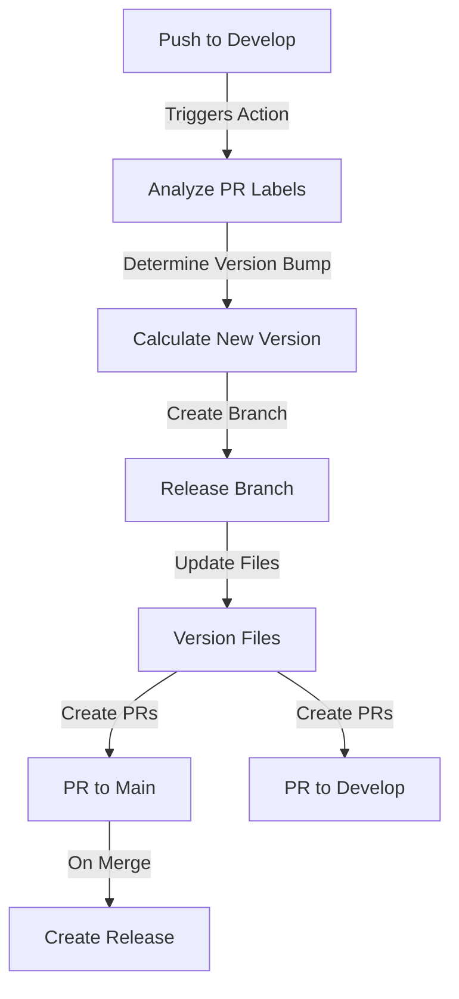

# GitFlow Automation Action 🔄

[](https://github.com/raultoto/gitflow-automation/releases)
[](https://github.com/marketplace/actions/gitflow-automation)
[](https://opensource.org/licenses/MIT)

Automate your GitFlow release process with this GitHub Action. It handles version management, branch creation, and pull request generation following GitFlow conventions.

## 🌟 Features

- 🔄 **Automated GitFlow Process**: Streamlines the entire release workflow
- 📦 **Smart Version Bumping**: Automatically determines version increments based on PR labels
- 🏷️ **Semantic Versioning**: Follows SemVer conventions for version management
- 🔀 **Branch Management**: Creates and manages release branches automatically
- 📝 **Documentation**: Generates release notes and PR descriptions
- 🤝 **Pull Request Creation**: Automatically creates PRs for main and develop branches
- 📋 **Version File Updates**: Updates version numbers in multiple file types

## 📊 GitFlow Process



## 🚀 Usage

Add this workflow to your repository at `.github/workflows/release.yml`:

```yaml
name: GitFlow Release Process
on:
  push:
    branches:
      - develop

permissions:
  contents: write
  pull-requests: write

jobs:
  release:
    runs-on: ubuntu-latest
    steps:
      - uses: actions/checkout@v3
        with:
          fetch-depth: 0

      - name: Run GitFlow Automation
        uses: raultoto/gitflow-automation@v1
        with:
          github-token: ${{ secrets.GITHUB_TOKEN }}
          version-files: "package.json,VERSION"
          base-branch: "main"
          develop-branch: "develop"
```

## ⚙️ Configuration

### Inputs

| Input | Description | Required | Default |
|-------|-------------|----------|---------|
| `github-token` | GitHub token for API access | ✅ | N/A |
| `version-files` | Files to update versions in | ❌ | `VERSION` |
| `version-regex` | Regex pattern for version matching | ❌ | `version": ".*"` |
| `base-branch` | Target branch for release | ❌ | `main` |
| `develop-branch` | Development branch name | ❌ | `develop` |

### Outputs

| Output | Description |
|--------|-------------|
| `new-version` | The newly created version number |
| `release-branch` | Name of the created release branch |
| `version-bump` | Type of version bump performed |

## 📋 Version File Support

The action supports various version file formats:

### VERSION file
```plaintext
v1.0.0
```

## 🏷️ PR Labels and Version Bumping

The action uses PR labels to determine the version bump:

| Label | Version Bump | Example |
|-------|-------------|---------|
| `major` | Major version | 1.0.0 → 2.0.0 |
| `minor` | Minor version | 1.0.0 → 1.1.0 |
| `patch` | Patch version | 1.0.0 → 1.0.1 |

## 🔄 Workflow Steps

1. **Trigger**: Action runs when code is pushed to develop branch
2. **Analysis**: Determines required version bump from PR labels
3. **Version**: Calculates new version number
4. **Branch**: Creates new release branch
5. **Update**: Updates version in specified files
6. **PRs**: Creates pull requests to main and develop
7. **Release**: Creates GitHub release with notes


## 📄 License

This project is licensed under the MIT License - see the [LICENSE](LICENSE) file for details.

## 👥 Author

Your Name ([@raultoto](https://github.com/raultoto))

## 🙏 Acknowledgements

- Inspired by GitFlow workflow practices
- Built with GitHub Actions
- Uses Semantic Versioning
